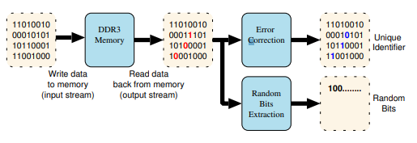

#### Hardware_Security_Sheet_3
###### Dated 07.12.2021
###### Compiled -  Deo, Pranav

**Task 1: Memory Based PUFs**

In general Memory based PUFs are better as they do not require any additional hardware, memory is present in virtually every system out there, and memory has become super cheap too in terms of production.

i.e., we have cost efficiency, plus we can make generate keys for less computation power (Lightweight), we have added benefit of generating keys even after production of the RAM chips are done.

**1.1 Describe the way in which SRAM PUFs work. What is their disadvantage and how could their reliability be improved? (3 points)**

SRAM (Static Ransom Access Memory) based: Use the design and working principle of the SRAM

 - Use of flip flop based latching circuits
 - The way that SRAMs are designed is that they have usually upto 6 MOSFETs (transistors).
 - Each bit in an SRAM cell is stored on four transistors that are *connected in two cross coupled inverters*. The two additional transistors are **access transistors** which are used to provide access control during read and write operation.
 - The SRAM cells as a result of above design have their preferred state `[0 or 1]` that they revert to as soon as they are powered up. This is due to differences between the inverters, the so called larger inverter is what decides the preferred state.
 - Due to manufacturing variations, each cell is different and thus has a different preferred state.
 - As such, when we power on the device, we have a unique series/ pattern of `0s and 1s`, and this pattern can be used a a fingerprint for the device.
 - Different SRAM chips will have different patterns/ fingerprints, again due to the manufacturing variations.

**1.2 Explain by means of an illustrative example how DRAM decaying PUFs work. What is their advantage/disadvantage compared to why one might prefer/avoid them over SRAM PUFs? (4 points)**


- DRAMs cells consists of one transistor and once capacitor as opposed to four or six transistors in a SRAM cell.
- Capacitors have a tendency to discharge over a period of time (dielectric leakage).
- As such, in DRAM cells, written data is read over a period of time and then the stored data is re-written to avoid any loss of data.
- This cycle of re-writing can be done as often as every 32 to 64 ms depending on capacitor specifications and operating temperatures.

In reference to [[1]](#1), they have explored the use of DRAM based PUFs for TRNG and Unique Identifier formation.

 

**Pic source: paper mentioned in reference [[1]](#1).

- As said above, there is a loss of charge that happens in a node/ cell over time period.
- The loss can be due to leakage through non conducting transistors, gate leakage of access transistor, loss of capacitor charge etc.
- The leakage though is not always constant, and depends highly on the component characteristics. And as established, in silicon manufacturing processes, there is always production difference that lead to slight variations in component characteristics.
- The authors fed DRAMs with some initial input data that was read back after some time from the memory array. The cells which tend to discharge have tendency to flip the input bit and then give an output.
- The data was compared with input data, and several such iterations were done.
- Here upon, authors determined two different types of cells
 -- 1. Perfectible cells: Cells that have a predictive behavior to either not flip any bit or a perfectible behavior to discharge and flip a bit.
 -- 2. Unpredictable Cells: Cells whose behaviors can not be predictable.
- A unique fingerprint can then be generated by isolating the cells that have unpredictable behavior and using them on a error correction code.

Comparison:

- DRAM pufs are cheaper to produce than SRAM pufs.
- DRAM pufs are more robust than SRAM pufs and tend to be more reliable in outputting constant stream.
- In general DRAM pufs are more stable over a long period of time as compared to SRAM pufs.


##### References
<a id="1">[1]</a> 
C. Keller, F. Gürkaynak, H. Kaeslin and N. Felber 
"Dynamic memory-based physically unclonable function for the generation of unique identifiers and true random numbers"
2014 IEEE International Symposium on Circuits and Systems (ISCAS), 2014, pp. 2740-2743, doi: 10.1109/ISCAS.2014.6865740.
link: https://ieeexplore.ieee.org/abstract/document/6865740?casa_token=vnbCZbgLCCcAAAAA:OiKImv5xRISjWV9wEqEqCYvVkiuMQh39ra8_0BOkFcqu8oLDp3um2qp58uJiZnLSrzyJoBKO8g

<a id="2">[2]</a> 
https://link.springer.com/chapter/10.1007/978-3-662-53140-2_21


**1.3 Consider briefly how memory-based combination PUFs could be used to enable device authentication in embedded systems? A general description of the architecture or approach is sufficient (you do not have to go into the smallest detail). (5 points)**

- The IoT infrastructure is heavily reliant on the deployment of embedded systems. The concept of Root of Trust is important in IoT to authentication, storing of sensitive data, and facilitating secure communications.

- A PUF could be used to generate a root key which protects all other stored keys which are used for authentication purposes.

Considering a challenge response based mechanism for device authentication:

-  verifying entity is placed that authenticates devices that have RAM based PUFs.
- The verifying entity initially sends a set of challenges to all the devices and stores the responses in its database.
- Upon actual implementation, the entity sends the a random challenge to the device, the device then computes a PUF response based on it's ram based PUF, and computes the challenge.
- The hash of the challenge is then sent to the entity, which can crosscheck it against the database, and authenticate device if hash matches (a certain amount of threshold tolerance can also be allowed by the entity to account for puf response noise).


**Task 3: Error Correction**

**3.1 A PUF is measured twice and returns the following sequences:**
**Apply the indices to stable bits method over these two measurements. (3 points)**


In the indices to stable bits method, we basically identify what the stable bits are and this use only the stable bits.
In following example, the samples measurement count of two is technically insufficient to evaluate if the stable bits are indeed 100 percent stable.
```
Measurement 1: 1010010001100001111100110101000001100111110001010111001001100110
Measurement 2: 0110111001101001000100111101001001100111110001010111001001100110
Mask         :   ** * ***** ***   ***** ***** *********************************
Response     :   10 1 00110 001   10011 10100 001100111110001010111001001100110

```

**3.2 Describe the Code Offset Method. What is its advantage and disadvantage? (3 points)**

In code offset method,

- The initial puf measurement is taken, say `X`.
- A random word `W` is chosen carefully depending on what kind errors are to be expected, the frequency of errors and the failure probability.
- A code word is calculated as `code word c = X xor W` and we store ` W & hash(X xor W)`
- A new measurement of PUF is taken, say `Y`.
- We can now find a new code while correcting Y, `new code c_new = Y xor W`, and compute the `hash(c_new)`.

*Advantage:*
- Usually corrects all the errors in the code.

*Disadvantage:*
- Implementation is slow compared to other methods.
- Right code word has to be chosen carefully.