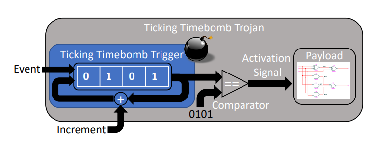

#### Hardware_Security_Sheet_4
###### Dated 14.12.2021
###### Compiled -  Deo, Pranav


**Task 1: Intro to Hardware Trojans**

**1.1 Give a definition for “Hardware Trojans” and explain their properties in your own words.**

Hardware Trojan (Hereby referred as HT) is a malicious modification of the circuitry of an integrated circuit. These modifications tampers with the design flow of an circuit, this adding/ removing functionality and affects the reliability of IC negatively.

Hardware payload: The activity that an Hardware Trojan triggers from  from the moment it executes. 

Some properties of a HT:

- It is usually hidden in the circuitry. It is very hard to isolate or identify the HT. HT may perform very similar to the original intended function of the circuit/ part of circuit, it cannot be distinguished before the HT is triggered.

- They can be characterized based on many parameters, such as:

-- its physical properties (is it a functional - i.e adds/ deletes transistors, gates or IC components, or parametric HT - changes circuitry design). 

-- The activation characters, that is how the HT is triggered (discussed below in 5.5).

- The HT is usually quite inactive and thus not detected during the testing phase. It is  usually triggered by special codes, or input stimuli.

- The HT need to be triggered by an input stimuli, and the it executes the `payload`.

```
Input Stimuli --> HT Trigger --> Circuitry Modified --> HT payload executed -->Effect
                |----------------------------------------------------------|
                                       (HARDWARE TROJAN)

```

**1.2 State two potential application areas that hardware Trojans can attack and briefly discuss them through an example for each.**


**1.3 Give two examples of hardware Trojans from the news and explain what the issues were.**

Hardware Trojan have been in the news since frequently. Some few examples are already mentioned in the lecture slides, such as the  Syrian radar case, Chinese fake ICs etc.

- https://spectrum.ieee.org/hardware-trojan

It is of utmost importance that Air Traffic Control(ATC)  radars and other air traffic are able to identify the category of airplanes around them. One cannot mistake commercial aircraft makes for a military aircraft, such implications can be dangerous and have indeed led to incidents where the military of one country might attack a harmless commercial aircraft by mistaking it for hostile aircraft. Or it may also happen that the defense military may not correctly be able to identify an actually hostile aircraft.

Faulty aircraft radars ( specifically those that have been outsourced or built by third parties) may contain certain HWTs to falsely identify certain aircraft types on purpose. The US military has started a program named  SHEATH (for Safeguards against Hidden Effects and Anomalous Trojans in Hardware), wherein a program called TEMPEST was designed, TEMPEST can identify if a device has a HWT or has already been compromised by simply scanning the electromagnetic emissions from the device.


- https://www.techradar.com/news/this-quantum-chip-has-been-infected-with-dangerous-malware-but-for-a-good-cause

Researchers have created a chip with four hardware trojans on it, which they plan to use to analyze and develop effective techniques to counter such hardware-based attacks.

The chips, developed  at the Technical University of Munich (TUM), are intended to easily perform post-quantum cryptography, as quantum computers are likely to render present encryption algorithms obsolete.

The chip is an application-specific integrated circuit (ASIC) and is a modification of an open source chip design based on the open source RISC-V standard. The design also incorporates a purpose-designed hardware accelerator.

Reasoning that hardware-based trojans could nullify the advantages of a post-quantum cryptography, the researchers also incorporated some into their chip to watch and study them in action.

**1.4 Describe three different effects of Hardware Trojans. (3 points)**

Hardware Trojans are capable of doing the following::

HT also negatively affect the CIA factors of the IC. How?

- *Availability*: HT reduce performance of the IC and thus impact on the availability criteria. The down-time that a system may have to face due to a HT related issue, specially for components in a critical runtime reduces availability. DOS attacks on systems maybe performed such as deployed kill switched or disabling important component.

- *Confidentiality*: Critical information may be leaked by a HT payload, such as passwords, keys and such.

- *Integrity:* Changing functionality of the Integrated Circuit. As such it include bypasses to alter some core functions or some sub-functions that the IC partakes in. Altering the subfunctions may also affect the end result of the IC. This can affect various computations that the IC has to do, and/ or affect components that rely on the IC computations. (say Randoms Number Generators.)


**1.5 Hardware Trojans can be activated in different ways. Describe three different tyes of activations and describe a sample of each.**

The activation of a HT is usually condition based and they require an stimuli (such as input pattern, internal logic states, some sensor trigger, some sort of counter trigger etc.)

- A HT can be `Always on`, meaning that there is no special trigger, the HT exists and it simply executes some payload. Example, an IC with reduced wire, will fail every time the faulty wire is used extensively or produce some fault. 

- A Ht can be `internally` activated, such that it waits for an internal stimuli to trigger the trojan. It can be an unusual internal state, some internal clock based trigger or so on. The HT might also trigger for specific durations, example it is triggered only during a particular span of some internal countdown.

- A HT can be `externally` activated in that there is some logic inside the chip can either monitors an external stimuli or os somehow triggered by an external stimuli. The logic then executes the payload. Example a specific radio based input to the IC triggers a malicious logic.  Or the IC is connected to some sensors, and specific state(s) of the sensors invoke a code/ logic that may be malicious.  


**1.6 Describe how time bombs work. Also describe a scenario where a time bomb can be used?**

In a Time Bomb HT, there is a synchronous counter that is used to trigger the payload. The counter counts up to some value that is defined, and as soon as that value is achieved, the payload is triggered.

Given below is an image of a Ticking Time Bomb Trigger. In given example, the system approaches HT trigger/ activation as and when the system runs for longer period. That is, the longer the system runs, the better the chances of the trigger to get activated. There is a non repeating sequence counter which keeps a track of this, and increments counter value upn getting some symbol.

 

**Pic source: mentioned below paper).

Thus, a time bomb can be used in a scenario wherein we know that the payload has to be delivered after a certain amount of time and we thus time the trigger moment while designing and embedding the trojan initially.

https://rtcl.eecs.umich.edu/rtclweb/assets/publications/2021/bomberman-oakland-21.pdf

**1.7 Describe how Dopant Trojans work? What is their effect?**

(doping as a verb refers to adding impurities. As such Dopant Trojans add various 'impurities' at the transistor level.)

Doping change the ability of semiconductors to conduct electricity, and thus can affect the behaviour of semi-conductors (in this case, we affect the behavior of the gates in transistors.)

- Dopant Trojans are usually implemented at the Transistor level. 

- Certain amount of doping is done in the gates of the transistor to change the behavior of the transistor in a predictable manner.

- for example consider a CMOS transistor consisting of NMOS and PMOS transistor. this CMOS inverter always outputs `Vdd, logical 1`

- Doping the gates of NMOS and PMOS to affect the polarity of different part causes the connections between the PMOS NMOS and CMOS to change nd behave differently.

**1.8 Explain in detail how two different categories of hardware Trojans work, i.e. how they are triggered and what their effects may be.**


**Task 2: Prevention and Detection of Hardware Trojans**

**2.1 In which types/categories can countermeasures against hardware Trojans be classified, according to the purpose they fulfill? What is the purpose and characteristics of each type?**

There are three types/ categories for Hardware Trojans countermeasures to be classified as:

*1. Detection of HWT:*  Herein, we determine if the system / IC components have HWTs embedded inside. 

*2. Diagnose the IC for HWT:* We check the IC for various HWT that may be embedded, and try to classify them as per their taxonomy. This approach is destructive in nature, and and expensive. Also the problem is that the result of a single IC may or may not extrapolate to ICs of same make/ batch.

*3. Prevention:* Preventing a mishap is always the best policy. Herein we employ techniques that make it difficult/ impossible to potentially embed a HWT. Methods include techniques such as removing excess space for hardware trojans or obfuscation of circuit functionality.
As such prevention techniques not only improve the detection of HWTs and make it easier to diagnose ICs for HWT, but also embed a certain level of trust for  the end user or deployer.